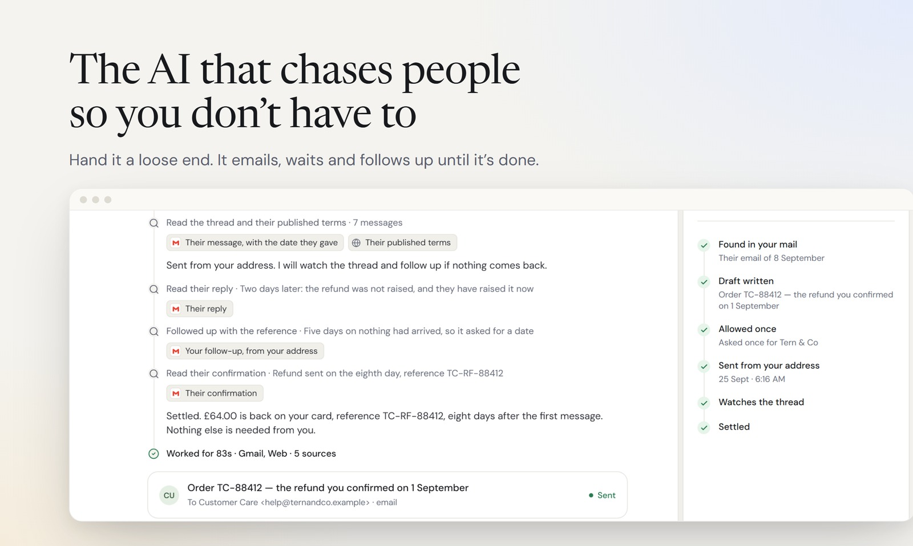
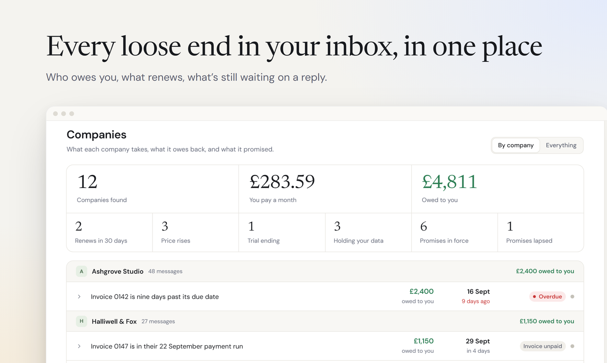
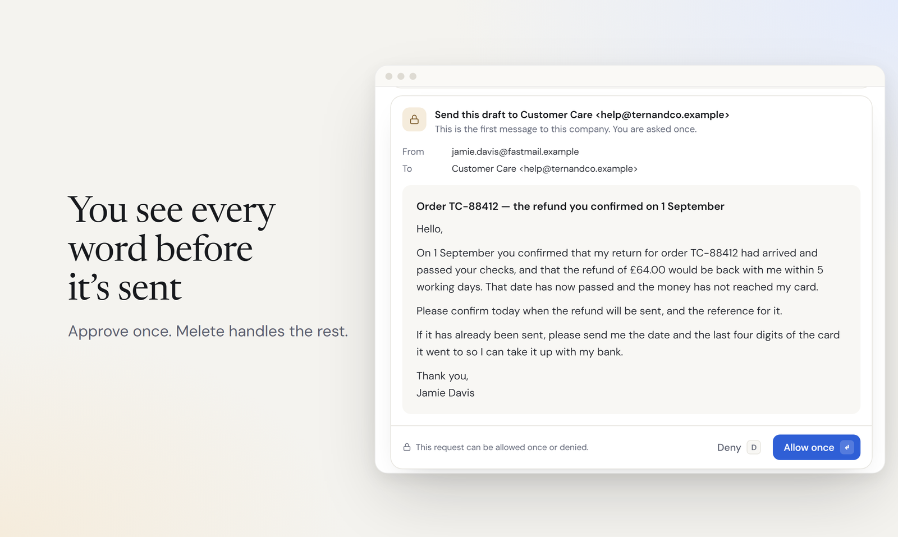
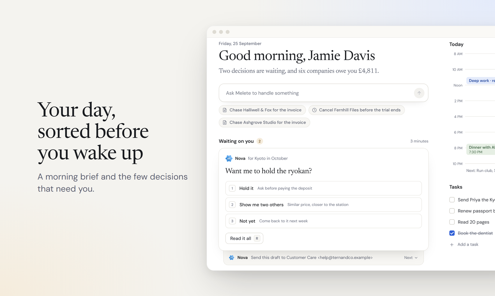
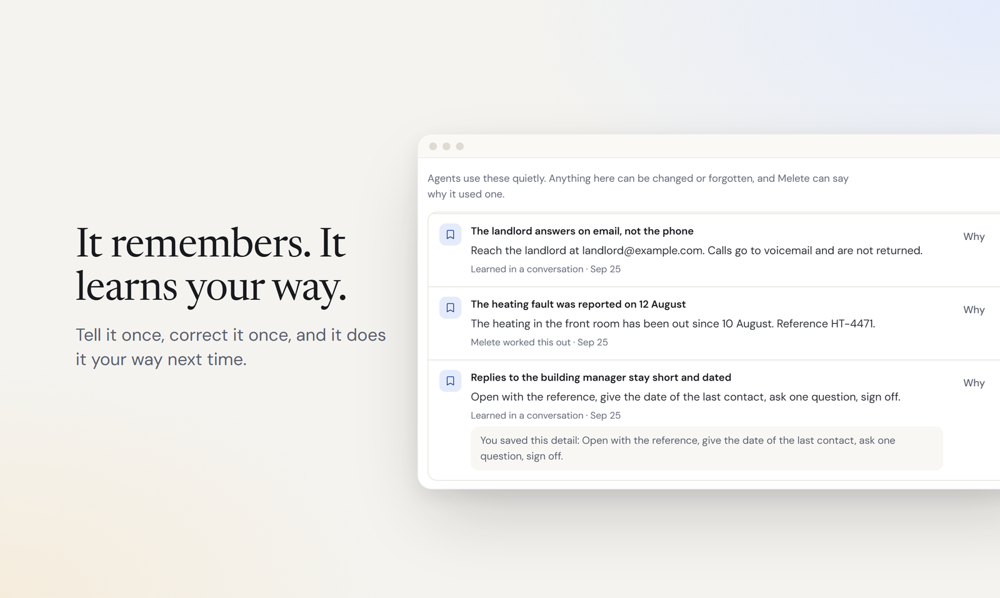
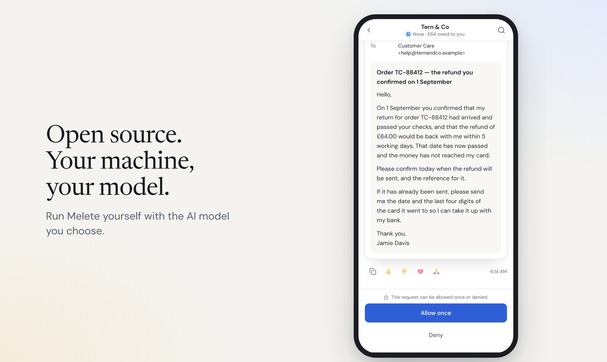

# Melete

**A personal assistant that follows through.**



<!-- DEMO SLOT: when docs/assets/readme/demo.gif exists, embed it here as an
     image with the alt text "Melete taking a loose end from inbox to settled". -->

Hand Melete anything with a loose end: a reply you're owed, a refund, a booking
to move, a bill to query. It writes the email from your own address, waits,
follows up when a date passes, and tells you when it's settled. You see every
message before it goes out, and it never sends the same one twice.

## What it does

### Finds every loose end in your inbox



Connect a mailbox and Melete lists every company in your life: what you pay
each month, what you're owed, what renews next, whose trial ends this week.
Every figure opens the sentence in the email it came from. Pick one item, or
hand it the lot, and Melete takes it from there, quoting the company's own
words back to it.

### Shows you every word first



Each message waits for your yes, with the full text in front of you. Your yes
covers exactly those words; change the recipient or the amount and it asks
again. For someone you trust, allow a set number of messages until a date you
choose.

### Sorts your day before you wake up



A morning brief, the few decisions that need you, and your calendar and tasks
beside them. Answer with one tap and it carries on.

### Remembers, and learns your way



Tell it once how you like things done and it does them that way next time.
Everything it remembers is listed with where it came from; change it or forget
it whenever you like.

## Run it



Melete runs on your own machine with Docker. You need Docker Engine 28 or newer
with Docker Compose 2.33.1 or newer, [Bun](https://bun.sh), Git, about 10 GB of
free disk, and ports 3100 and 3101 free. On Windows, follow
[Windows (Docker Desktop)](docs/DEPLOYMENT.md#windows-docker-desktop) instead.

```bash
git clone https://github.com/ychampion/melete.git
cd melete
bun install --frozen-lockfile
bun run deploy/scripts/configure.ts --fake
docker compose -f deploy/docker-compose.yml up -d --build --wait --wait-timeout 180
```

Open **http://localhost:3101** and create your account.

`configure.ts --fake` writes your private settings to `deploy/.env` and starts
Melete in walkthrough mode: a scripted model plays one job end to end, so you
can watch a request become a message, an approval and a receipt before you
connect a model of your own. Keep `deploy/.env` with your backups; it holds the
key that unseals your stored passwords.

Add your mail and calendar in **Settings → Connections**. Gmail and iCloud
connect with an app password, and any IMAP or CalDAV account with its password.
Outlook.com accepts only its own sign-in, so it cannot be connected.

[Deployment](docs/DEPLOYMENT.md) covers remote hosts, HTTPS, reaching Melete
from your phone over Tailscale, backups, upgrades and removing it completely.

## Connect your model

Melete works with the model you choose. Set these in `deploy/.env`:

| `MELETE_DEFAULT_PROVIDER` | What it needs |
| --- | --- |
| `anthropic` | `ANTHROPIC_API_KEY` |
| `openai` | `OPENAI_API_KEY` |
| `chatgpt` | Your ChatGPT sign-in, using your plan |
| `google` | `GOOGLE_API_KEY` |
| `fireworks` | `FIREWORKS_API_KEY` |
| `openai-compatible` | `OPENAI_COMPAT_BASE_URL` and a key, including a model server on your own network |

Set `MELETE_DEFAULT_MODEL` to the model's name as the provider writes it, set
`MELETE_ENABLE_FAKE_PROVIDER=false`, and restart the two services that use it:

```bash
docker compose -f deploy/docker-compose.yml up -d --force-recreate --wait melete runtime
```

[Providers](docs/DEPLOYMENT.md#providers) has the details, including signing in
with ChatGPT.

## Plugins

Plugins give Melete new tools. Add any MCP server in
**Settings → Connections**, over HTTP or from a package or image; a packaged
server runs in its own locked-down container. A starter set (files, fetch, time
and GitHub) is listed at `GET /plugins`, and each one installs with a single
request that asks only for the values it needs.

Melete can also run code in a cloud sandbox. Connect an [E2B](https://e2b.dev)
or [Modal](https://modal.com) account as a **Sandbox** connection and your jobs
can use it.

## How it keeps you in control

- **Approvals.** Every message waits for your yes, or for a limit you set for someone you trust.
- **Receipts.** Every message, event and file it produces is recorded: what, where and when.
- **Undo.** Anything that can be taken back carries an undo you can use while it is still valid.
- **Memory you can see.** Change or forget anything it knows; a forgotten fact stays forgotten, even after a restore.

## Documentation

- [Deployment](docs/DEPLOYMENT.md): hosting, providers, Tailscale, backups and removal
- [Upgrading](docs/UPGRADING.md): moving an installation to a later release
- [Connectors](docs/CONNECTORS.md) and [mail and calendars](docs/mail-calendar.md)
- [Browser worker](docs/browser-worker.md): the browser Melete drives, and taking over from it
- [Memory](docs/MEMORY.md) and [learning](docs/LEARNING.md)
- [Architecture](docs/ARCHITECTURE.md) and [threat model](docs/THREAT-MODEL.md)
- [Building a client](docs/CLIENT.md): the API and how the app uses it
- [Contributing](CONTRIBUTING.md): setting up, testing and sending changes

## Licence and credits

Melete is Apache-2.0; see [LICENSE](LICENSE) and [NOTICE](NOTICE). Report a
security issue through the [security policy](SECURITY.md).

Melete's agent runtime is built on
[Hermes Agent](https://github.com/NousResearch/hermes-agent) by Nous Research,
customised for Melete.
