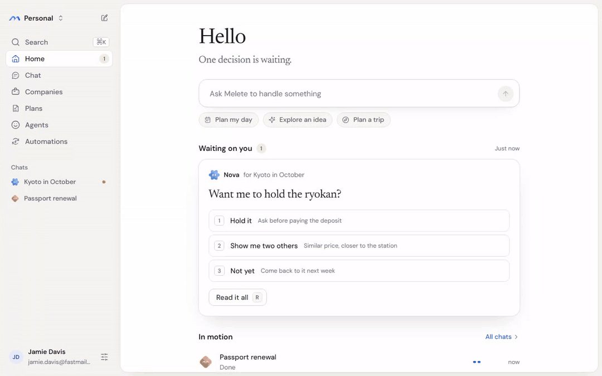
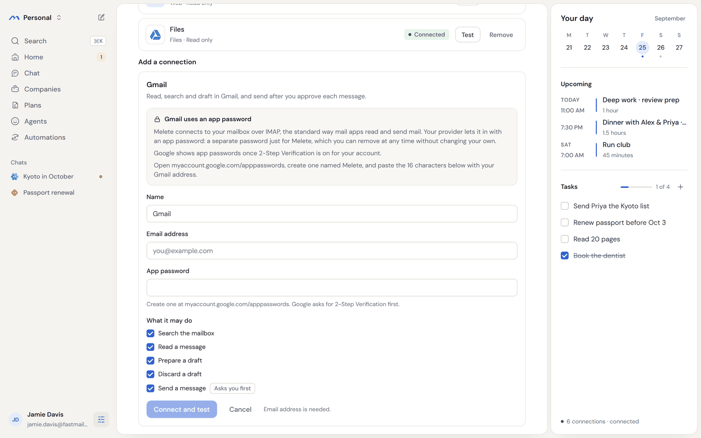
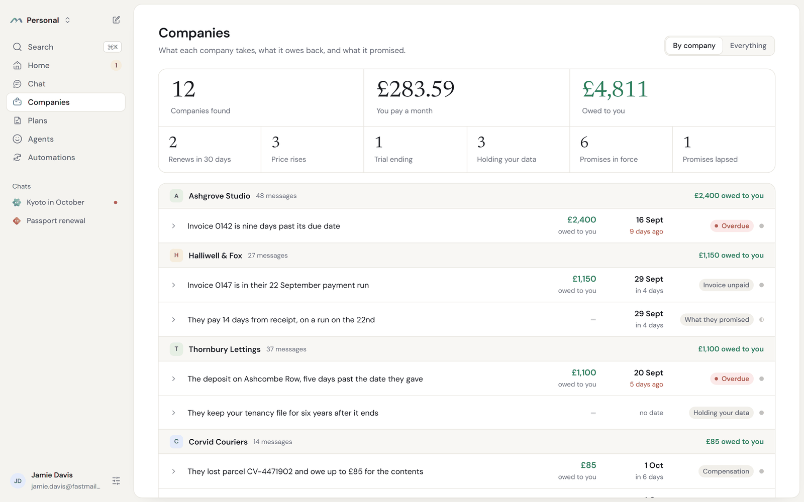
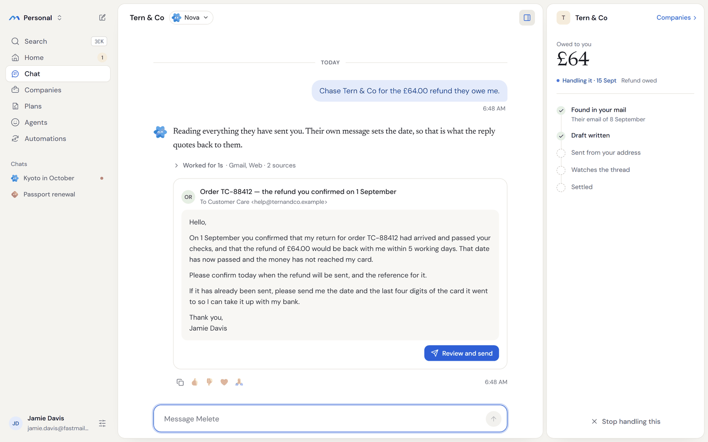
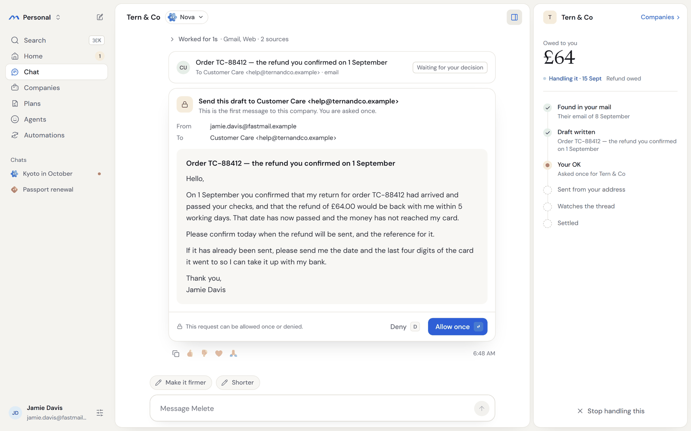
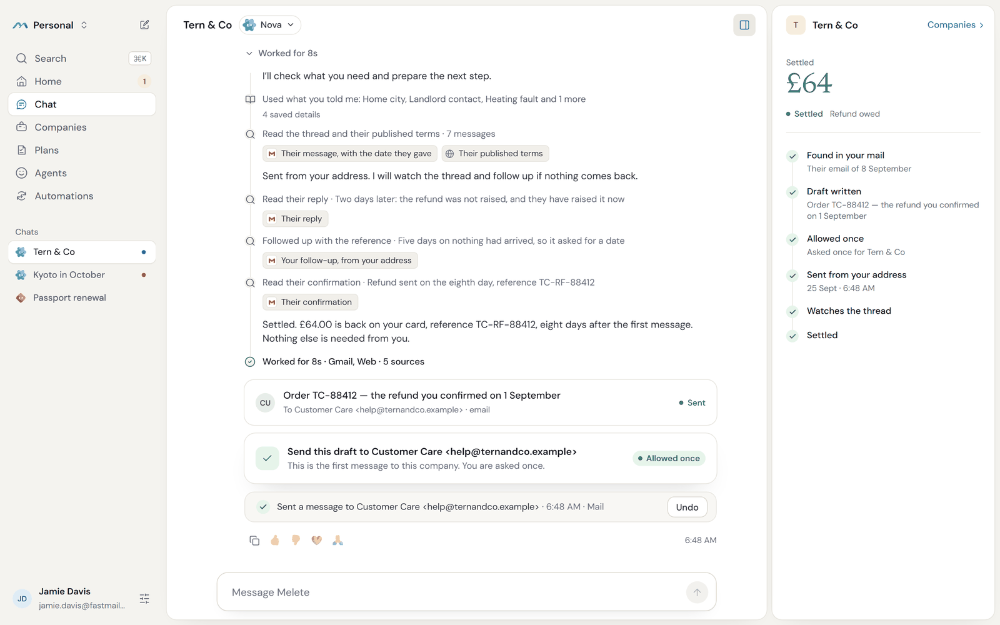

# Melete

A personal assistant that follows through: it writes the email, waits, follows up, and tells you when it's done.

> Melete is in early beta. Hosted Melete and our website are coming soon. For
> now, you can run it yourself.



Hand it a loose end, like a refund you were promised or a reply you're still
waiting for. Melete writes from your own address, and you see each message
before it goes out.

## Try it

A hosted version you can try in your browser is coming soon. Until then, you
can [run it yourself](#run-it-yourself) on your own computer or a small server.

## See it work

1. **Connect your inbox.** Gmail and iCloud take an app password, and most other
   mailboxes connect over IMAP.

   

2. **See what's open.** Melete reads your mail and lists what each company owes
   you and what is overdue.

   

3. **Hand it one.** Ask it to chase the refund, and it drafts an email that
   quotes the date the company gave you.

   

4. **Approve the exact email.** You see who it's from, who it's to and every
   word, and nothing goes until you allow it.

   

5. **It follows up until it's settled.** When the money doesn't arrive, it
   writes again with the reference, and tells you when the refund is back.

   

## Run it yourself

Needs Docker, Bun and an API key for your model provider.

```bash
git clone https://github.com/ychampion/melete.git && cd melete
bun install --frozen-lockfile && bun run deploy/scripts/configure.ts
docker compose -f deploy/docker-compose.yml up -d --build --wait
```

Before the last line, open `deploy/.env` and set `MELETE_DEFAULT_PROVIDER`,
`MELETE_DEFAULT_MODEL` and your provider's key, as listed under
[Connect your model](#connect-your-model). Then open http://localhost:3101 and
create your account.

To see a demo with a practice model first, run `configure.ts --fake` instead.
You can switch to your own model later.

[Deployment](docs/DEPLOYMENT.md) has the version requirements, Windows, remote
servers, HTTPS, Tailscale, backups and how to remove Melete.

## Set it up with your coding agent

Paste one of these into Claude Code, Codex or Cursor.

To run it on a small cloud server:

```text
Create a small Linux VM on my cloud provider (Ubuntu 24.04, 2 vCPU, 4 GB RAM,
30 GB disk) and connect to it over SSH. Install Docker Engine 28 or newer with
the Compose plugin, following Docker's official instructions for Ubuntu. Then
install Melete from https://github.com/ychampion/melete by following the
"Install on a Linux Docker host" section of its docs/DEPLOYMENT.md, which also
installs Bun. Set my model provider in deploy/.env as that section says, using
the key I give you. Melete listens only on the VM's own loopback address, so
keep ports 3100 and 3101 closed to the internet. When it's running, give me the
SSH tunnel command from docs/DEPLOYMENT.md so I can open http://localhost:3101,
and summarise what that file says about HTTPS and Tailscale for reaching it from
my phone.
```

To run it on this computer:

```text
Clone https://github.com/ychampion/melete and run it on this machine with
Docker, following the "Run it yourself" section of its README. First check that
Docker Engine is 28 or newer and Docker Compose is 2.33.1 or newer. If this
machine runs Windows, follow the "Windows (Docker Desktop)" section of
docs/DEPLOYMENT.md instead. Before starting it, set my model provider in
deploy/.env using the API key in my environment, without printing the key. When
`docker compose -f deploy/docker-compose.yml ps` shows the services running and
healthy, tell me to open http://localhost:3101.
```

To connect your email and calendar:

```text
Help me connect my email and calendar to Melete at http://localhost:3101.
For Gmail, walk me through turning on 2-Step Verification and creating an app
password named Melete at https://myaccount.google.com/apppasswords. For iCloud,
walk me through creating an app-specific password at https://account.apple.com
under Sign-In and Security. Then tell me to open Settings, then Connections, and
add Gmail, iCloud Mail or Other mail (IMAP) for my email, and iCloud Calendar,
Other calendar (CalDAV) or Google Calendar (read only) for my calendar. Don't ask
me to paste any password into this chat.
```

To connect your model:

```text
Switch my Melete install to my own model. My API key is in my environment as
ANTHROPIC_API_KEY. In deploy/.env, set MELETE_DEFAULT_PROVIDER=anthropic, set
MELETE_DEFAULT_MODEL to the model I name, and copy the key into
ANTHROPIC_API_KEY without printing it. If MELETE_ENABLE_FAKE_PROVIDER or
MELETE_ENABLE_TEST_CONNECTOR is true, set it to false. Then run
`docker compose -f deploy/docker-compose.yml up -d --force-recreate --wait melete runtime`
and check `docker compose -f deploy/docker-compose.yml logs --tail=50 melete`
for a warning about the provider key. If my key is for another provider, use
the matching name and key from the Providers section of docs/DEPLOYMENT.md.
```

## Connect your model

Melete works with the model you choose. Set these in `deploy/.env`:

| `MELETE_DEFAULT_PROVIDER` | What it needs |
| --- | --- |
| `anthropic` | `ANTHROPIC_API_KEY` |
| `openai` | `OPENAI_API_KEY` |
| `chatgpt` | Your ChatGPT sign-in, using your plan |
| `google` | `GOOGLE_API_KEY` |
| `fireworks` | `FIREWORKS_API_KEY` |
| `openai-compatible` | `OPENAI_COMPAT_BASE_URL` and a key, which can be a model server on your own network |

Set `MELETE_DEFAULT_MODEL` to the model's name as the provider writes it. To
change model later, edit the file and restart the two services that use it:

```bash
docker compose -f deploy/docker-compose.yml up -d --force-recreate --wait melete runtime
```

[Providers](docs/DEPLOYMENT.md#providers) explains each one, including signing
in with ChatGPT.

## Plugins

Plugins give Melete new tools. You can add any MCP server in
**Settings → Connections**, over HTTP or from a package or image, and a packaged
server runs in its own locked-down container. There is also a starter set of
files, fetch, time and GitHub, listed at `GET /plugins`, and each one installs
with a single request.

Melete can also run code in a cloud sandbox. Connect an [E2B](https://e2b.dev)
or [Modal](https://modal.com) account as a **Sandbox** connection and your jobs
can use it.

## More it does for you

**Your day.** Home opens with a short morning brief and the decisions waiting on
you, next to your calendar.

**Memory.** Tell it once how you like things done and it does them that way next
time. You can see everything it remembers and change any of it. Something you
ask it to forget stays forgotten, even after you restore a backup.

## Security

- Every message it sends waits for your approval, or falls under a limit you set for someone you trust.
- The passwords and sign-in tokens it stores are sealed with your installation's master key.
- The agent's code runs in an isolated container that can reach only Melete's own service, which checks each action against what you allowed.
- Each person on an installation has their own space, and their jobs, drafts and receipts stay private to them.
- Every action it takes leaves a receipt, and one that can be reversed shows an Undo button while it still works.
- To report a vulnerability, follow [SECURITY.md](SECURITY.md). The [threat model](docs/THREAT-MODEL.md) has the details.

## Documentation

- [Deployment](docs/DEPLOYMENT.md): hosting, providers, Tailscale, backups and removal
- [Upgrading](docs/UPGRADING.md): moving an installation to a later release
- [Connectors](docs/CONNECTORS.md) and [mail and calendars](docs/mail-calendar.md)
- [Browser worker](docs/browser-worker.md): the browser Melete drives, and taking over from it
- [Memory](docs/MEMORY.md) and [learning](docs/LEARNING.md)
- [Architecture](docs/ARCHITECTURE.md) and [threat model](docs/THREAT-MODEL.md)
- [Building a client](docs/CLIENT.md): the API and how the app uses it
- [Contributing](CONTRIBUTING.md): setting up, testing and sending changes

## Licence and credits

Melete is Apache-2.0. See [LICENSE](LICENSE) and [NOTICE](NOTICE).

Melete's agent runtime is built on
[Hermes Agent](https://github.com/NousResearch/hermes-agent) by Nous Research,
customised for Melete.
