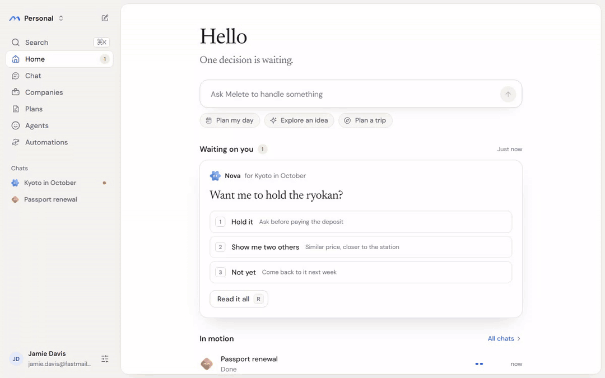

# Melete

**Personal superintelligence that runs as you.**

Melete lives on your own computers and works in every account you're signed
into: work and personal mail, both calendars, your files, your browser, your
servers. It keeps watch over all of it, day and night, notices what needs you,
and takes care of it.

> Melete is in early beta. You can run it yourself today.

Learn more at [melete.si](https://melete.si). Hosted Melete: join the waitlist at
[waitlist.melete.si](https://waitlist.melete.si).

## Try it

With Docker running, one command installs and starts Melete:

```bash
curl -fsSL https://raw.githubusercontent.com/ychampion/melete/main/install.sh | bash
```

On Windows with Docker Desktop, in PowerShell:

```powershell
irm https://raw.githubusercontent.com/ychampion/melete/main/install.ps1 | iex
```

Then open **http://localhost:3101** and create your account. It starts with a
practice model, so you can look around right away; add your own key in
**Settings → Models**. Run the command again to update. [Run it yourself](#run-it-yourself) shows the longer
manual path, and [Deployment](docs/DEPLOYMENT.md#one-line-install) lists the
installer's options.

## A day with Melete

**2:10 a.m. It notices.** The card on your domain renewal was declined, and the
notice went to an old personal address you rarely open. Melete watches every
inbox you connect, so by the time you're up the renewal page is open in your
browser, waiting for you to confirm the new card.

**8:30 a.m. Two calendars, one life.** The dentist moved your appointment, and
it now lands on a board call in your work calendar. Melete sees the overlap
across both calendars and has a reschedule drafted from the right address.

**11:00 a.m. Things only you are signed into.** Your accountant asks for last
quarter's numbers. Melete opens your bank in your own browser, where you're
already signed in, reads the statements and lines them up against the invoices
in your Drive. Two-factor prompts and logins work the way they do for you,
because it's your browser.

**4:45 p.m. Say it once.** "Dinner for six on the 9th, somewhere the kids will
like." Melete keeps hold of it until it's booked, and tells you plainly if time
is running short.

**On the drive home.** You talk, it answers out loud, and it keeps working while
you speak.

## Why it runs as you

- **One agent across your whole world.** Google, Microsoft, iCloud and any
  IMAP mailbox, your calendars and Drive, any app with an MCP server, and your
  own computer, all in one place, for one agent that sees how they connect.
- **Your sign-ins, your devices.** The [companion](docs/DEVICES.md) on your
  computer lets Melete use your browser signed in as you, the folders you share
  and the commands you approve, and it does only what both you and that computer
  allow.
- **It can afford to watch everything.** It runs on hardware you already have,
  with the model you choose, including one on your own machine. When nothing
  changes, nothing runs and nothing is spent.
- **Its own computer too.** Code, commands and long jobs run in a sandbox on
  [E2B](https://e2b.dev), [Modal](https://modal.com) or
  [Daytona](https://www.daytona.io), and a separate browser handles web forms,
  so heavy work never ties up yours.
- **You can check its work.** It asks before anything leaves your hands: a
  message to someone, a payment, a delete. Everything else leaves a receipt, with
  Undo while it still works. You can see, correct or forget anything it
  remembers, and a [privacy router](docs/PRIVACY-ROUTER.md) keeps account
  numbers and private conversations away from cloud models.



## Run it yourself

You need Docker, Bun and an API key for your model provider.

```bash
git clone https://github.com/ychampion/melete.git && cd melete && bun install --frozen-lockfile
read -rs FIREWORKS_API_KEY && export FIREWORKS_API_KEY; bun run deploy/scripts/configure.ts; unset FIREWORKS_API_KEY
docker compose -f deploy/docker-compose.yml up -d --build --wait --wait-timeout 300
```

The second line waits for you to paste your Fireworks API key and press Enter.
The key stays hidden, `configure.ts` writes it into `deploy/.env`, and the line
then clears it from your shell. For another provider, export its key instead and
name the provider and model, for example
`bun run deploy/scripts/configure.ts --provider anthropic --model <model id>`
with `ANTHROPIC_API_KEY`. Then open http://localhost:3101 and create your
account.

To try a demo with a practice model first, use
`bun run deploy/scripts/configure.ts --fake` as the second line. It needs no
key, and you can switch to your own model later.

On a server, you can skip the build and pull the published images instead:
[Using prebuilt images](docs/DEPLOYMENT.md#using-prebuilt-images).

`bun run melete check`, `bun run melete doctor` and `bun run melete status` judge
an installation and name what to do next:
[The melete command](docs/DEPLOYMENT.md#the-melete-command).

[Deployment](docs/DEPLOYMENT.md) covers version requirements, Windows, remote
servers, HTTPS, Tailscale, backups and removal.

## Set it up with your coding agent

Claude Code, Codex, Cursor or another coding agent can install Melete for you,
on this computer or on a server. It checks the machine, starts Melete, and tells
you when to create your account. You type your own passwords and keys, into
Melete or your own terminal, and the agent does the rest. Paste this:

```text
Set up Melete on this machine using https://github.com/ychampion/melete/blob/main/SETUP-WITH-AN-AGENT.md
```

The [guide](SETUP-WITH-AN-AGENT.md) also covers the optional parts: a computer
for the agent, voice, mail and calendar, and a public address for other
assistants. For Claude Code there is a [skill](skills/README.md) you can install
once.

## Connect your model

Pass the provider to `configure.ts` with `--provider` and `--model`, and export
the key it reads first:

| Provider | Key it reads |
| --- | --- |
| `fireworks` (the default) | `FIREWORKS_API_KEY` |
| `anthropic` | `ANTHROPIC_API_KEY` |
| `openai` | `OPENAI_API_KEY` |
| `google` | `GOOGLE_API_KEY` |
| `openai-compatible` | `OPENAI_COMPAT_BASE_URL` and `OPENAI_COMPAT_API_KEY`, which can point at a model server on your own network |
| `chatgpt` | No key. Once Melete is running, you sign in to your ChatGPT account under **Settings → Models**, or through its [sign-in routes](docs/DEPLOYMENT.md#signing-in-to-a-provider). |

You can also connect a provider from the app, in Settings › Models: paste a key,
test it, and choose the model, with no restart. Write the model's name the way the provider does. To change provider or model
later, edit `MELETE_DEFAULT_PROVIDER`, `MELETE_DEFAULT_MODEL` and the key in
`deploy/.env`, then restart the two services that use them:

```bash
docker compose -f deploy/docker-compose.yml up -d --force-recreate --wait melete runtime
```

[Providers](docs/DEPLOYMENT.md#providers) explains each one, including signing
in with ChatGPT.

## Connections and plugins

- **Mail and calendars.** Add them in **Settings → Connections**. Gmail and
  iCloud take an app password, and other IMAP and CalDAV accounts take their
  password. With your own Google or Microsoft app set in `deploy/.env`, Gmail,
  Google Calendar and Outlook connect by signing in
  ([Google setup](docs/mail-calendar.md#setting-up-your-google-client),
  [Microsoft setup](docs/mail-calendar.md#setting-up-your-microsoft-app)).
- **Any MCP server.** Add one over HTTP, or from a package or image, and a
  packaged server runs in its own locked-down container. A starter set of files,
  fetch, time and GitHub is listed at `GET /plugins`, and each installs with one
  request.
- **A sandbox.** Connect an E2B, Modal or Daytona account as a **Sandbox**
  connection, and the agent's terminal runs there, with a receipt for each
  command.
- **A browser.** The [browser worker](docs/browser-worker.md) fills forms in its
  own isolated browser.
- **Your own computer.** Pair it in **Settings → Devices** to share folders,
  approve commands, and let Melete use your browser signed in as you
  ([devices](docs/DEVICES.md)).

## Security

- Every message it sends waits for your approval, or falls under a limit you set for someone you trust. Approving a chase's first message also covers up to three follow-ups that repeat it to the same person, and you can withdraw that in **Settings → Rules**.
- The passwords and sign-in tokens it stores are sealed with your installation's master key.
- The agent's code runs in an isolated container that can reach only Melete's own service, which checks each action against what you allowed.
- Each person on an installation has their own space, and their jobs, drafts and receipts stay private to them.
- Every action leaves a receipt, and one that can be reversed shows an Undo button while it still works.
- To report a vulnerability, follow [SECURITY.md](SECURITY.md). The [threat model](docs/THREAT-MODEL.md) has the details.

## More it can do

- Talk to it: push-to-talk and a hands-free voice mode, with one ElevenLabs key ([voice](docs/VOICE.md)).
- Give it long work, and it keeps going in shifts for as long as it takes ([long work](docs/RUNS.md)).
- Use it from ChatGPT, Claude, Claude Code, Hermes or OpenClaw as a connector ([Melete as an MCP server](docs/MCP-SERVER.md)).
- Teach it by correcting it, then see, pause or remove what it learned in **Settings → Memory**.
- Start your day with a short brief of your calendar, your tasks and the decisions waiting on you.
- Correct or forget anything it remembers, and a forgotten fact stays gone after a restore.

## Documentation

- [melete.si](https://melete.si): the website
- [Deployment](docs/DEPLOYMENT.md): hosting, providers, sandboxes, Tailscale, backups and removal
- [Upgrading](docs/UPGRADING.md): moving an installation to a later release
- [Connectors](docs/CONNECTORS.md) and [mail and calendars](docs/mail-calendar.md)
- [Melete in other assistants](docs/MCP-SERVER.md): adding Melete to ChatGPT, Claude or Hermes as a connector
- [Browser worker](docs/browser-worker.md): the browser Melete drives, and taking over from it
- [Your own computer](docs/DEVICES.md): the companion, and what it allows
- [Noticing what changes](docs/SITUATIONAL-AWARENESS.md), [saying it once](docs/INTENTS.md) and [undo](docs/UNDO.md)
- [Memory](docs/MEMORY.md) and [learning](docs/LEARNING.md)
- [Architecture](docs/ARCHITECTURE.md), [privacy and isolation](docs/PRIVACY-AND-ISOLATION.md) and [threat model](docs/THREAT-MODEL.md)
- [Building a client](docs/CLIENT.md): the API and how the app uses it
- [Problem reports](docs/FEEDBACK.md): reporting a problem from the app, and pulling one by its id to fix it
- [Contributing](CONTRIBUTING.md): setting up, testing and sending changes

## Licence and credits

Melete is Apache-2.0. See [LICENSE](LICENSE) and [NOTICE](NOTICE).

Melete's agent runtime is built on
[Hermes Agent](https://github.com/NousResearch/hermes-agent) by Nous Research,
customised for Melete.
