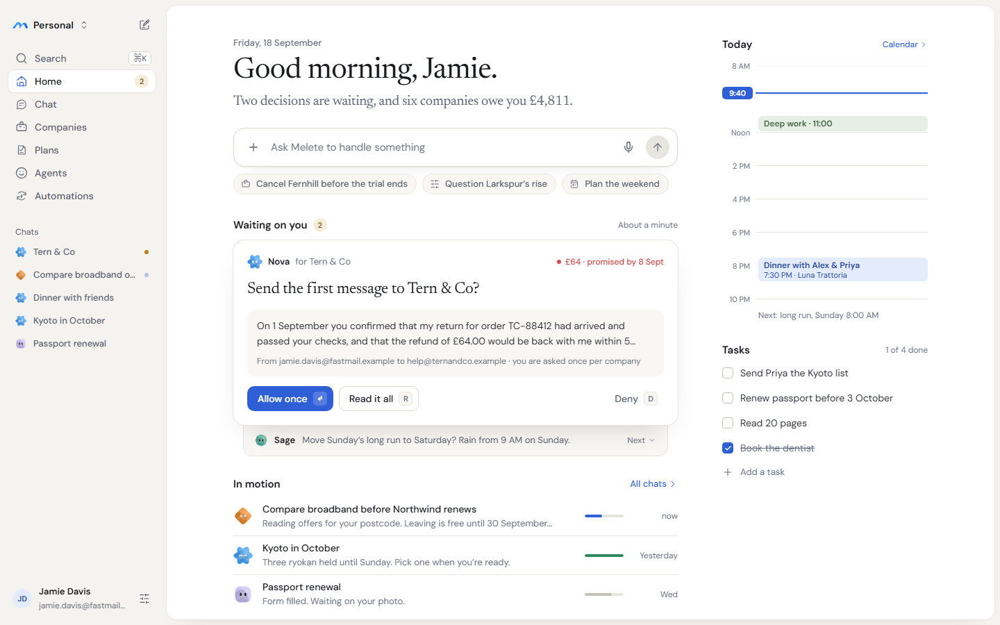
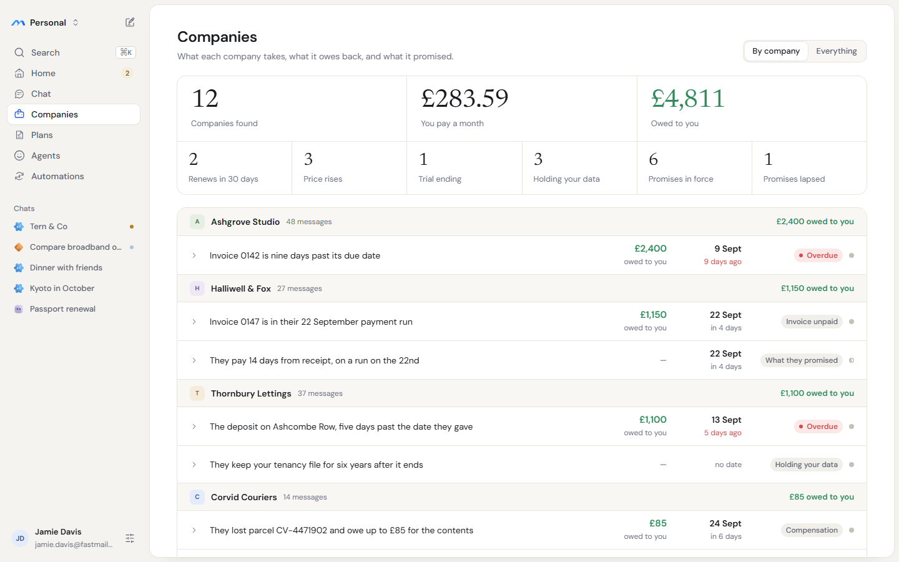
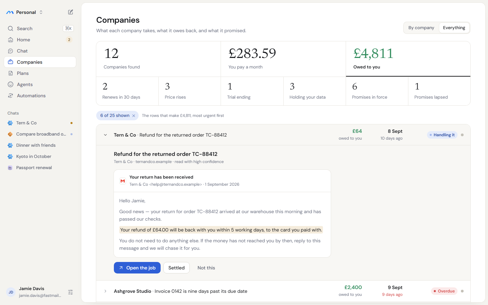
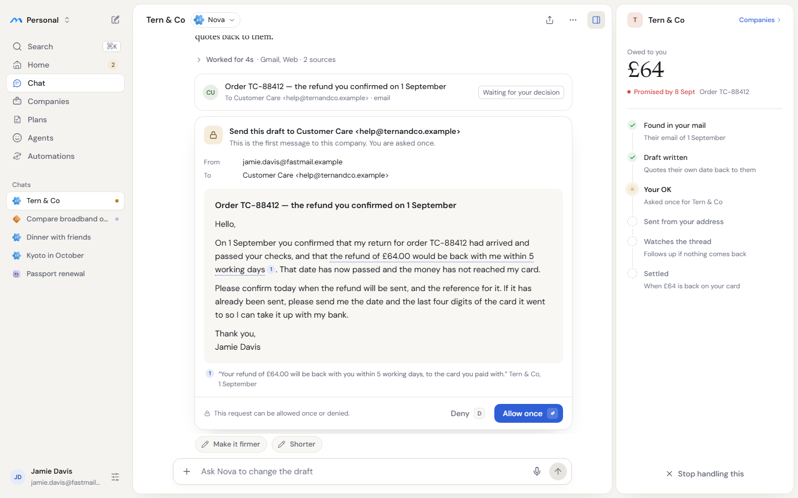
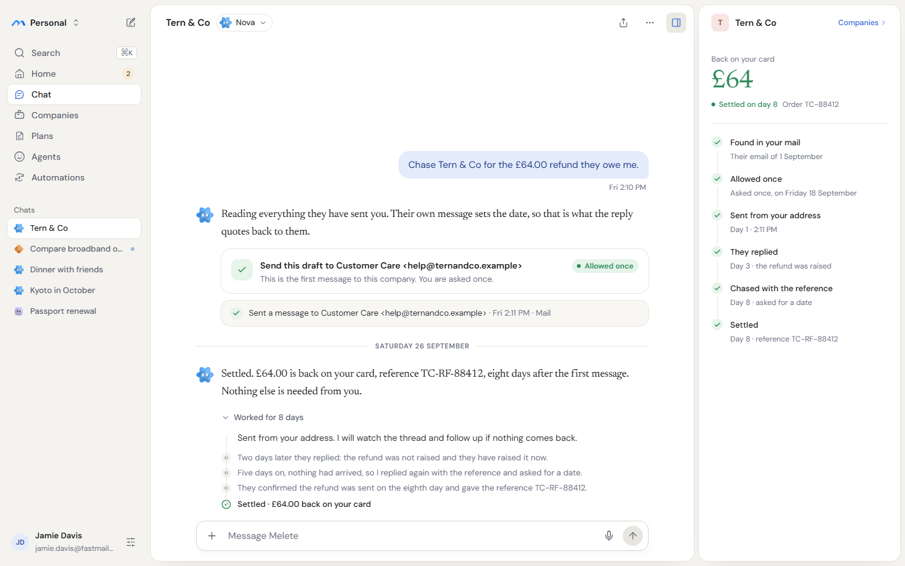

# Web design: sheets, a serif voice, and decisions as a queue

This folder specifies the next visual pass on the web app. It changes how the shell, Home, Companies and Chat look. It does not change the product: every flow, figure and product string on the Companies and approval screens stays as the service and the tests have them.

Start with the screenshots. Then open the previews in a browser and inspect them: every value is inline, so computed styles read straight off the page.



## What is here

| Path | What it is |
| --- | --- |
| `screenshots/*.png` | Every screen at its size: 1440 × 900 desktop, 390 × 844 phone, 1440 × 1960 for the design-language sheet. |
| `preview/*.html` | The same screens as static HTML, for inspecting spacing, type and colour. They are generated reference, not app code, so they sit outside `biome check`. |
| `assets/` | The two images the previews load. |

The screens are static comps. The Companies figures, names and dates come from the mock's demo mailbox (`apps/mock-api/src/companies-fixture.ts`), read on Friday 18 September. The app renders whatever the service returns, so nothing on a screen is copy to hard-code, apart from the fixed interface strings listed under "Rules".

| Screen | Files | Shows |
| --- | --- | --- |
| Home | `Main` | The morning brief, the decision queue, what is in motion, and today beside it. |
| Home, dark | `HomeDark` | The same screen in the dark theme. |
| Companies | `Companies` | Nine totals and the ledger grouped by company. |
| Companies, owed to you | `CompaniesOwed` | "Owed to you" pressed, the Everything arrangement, and one row open on its evidence. |
| The one question | `ChatApproval` | A company job asking once before its first message, with the case panel. |
| Settled | `ChatSettled` | The same job eight days later: allowed once, sent, followed up and settled. |
| Chat, dark, working | `ChatDark` | A general chat mid-run, with the trail and a result card. |
| Phone | `PhoneApproval` | The one question at 390 px. |
| Design language | `System` | Type, colour roles, figures, status, keyed actions and agent faces, in both themes. |

## The design language

Three rules carry the whole pass.

1. **Melete speaks in serif, the interface speaks in sans.** What Melete says is set in Newsreader: the greeting, the brief, its chat messages, the title of a decision, and money figures. Everything a person operates (labels, buttons, rows, headers) stays in DM Sans. Manrope is retired.
2. **Content floats on sheets.** The window is the paper colour. The sidebar sits directly on it without a border. Each page's content sits on a white sheet with rounded corners, inset 8 px from the window edge. A side panel, such as the case panel or the day rail, is a second sheet beside the first. The top bar goes: search and the space switcher move into the sidebar, and each page owns its header.
3. **Decisions are a queue you clear.** What needs the person is one card at a time, with its key on each action. The next item is visible underneath.

### Tokens to add

Add these to `src/design/tokens.css` beside the existing palette. The palette itself does not change.

```css
:root {
  --font-voice: "Newsreader Variable", "Newsreader", Georgia, "Times New Roman", serif;
  --font-head: var(--font-body); /* Manrope retired; headings are DM Sans 600 */

  --rose: #f6e5e1;
  --rose-ink: #8a4336;

  --radius-sheet: 14px;
  --radius-card: 16px;
  --radius-block: 12px;
  --radius-button: 10px;

  --shadow-sheet: 0 0 0 1px var(--line), 0 1px 2px #1d1b1608, 0 12px 32px -24px #1d1b1633;
  --shadow-lift: 0 0 0 1px var(--line), 0 1px 2px #1d1b160a, 0 18px 40px -22px #1d1b1640;
  --shadow-pill: 0 0 0 1px var(--line), 0 1px 2px #1d1b160f;
}
/* dark: add to both dark blocks */
  --rose: #2e1d1b;
  --rose-ink: #e3b0a6;
  --shadow-sheet: 0 0 0 1px var(--line);
  --shadow-lift: 0 0 0 1px var(--line-strong), 0 20px 40px -16px #000000;
  --shadow-pill: 0 0 0 1px var(--line);
```

Font: add `@fontsource-variable/newsreader`, import it in `src/main.tsx` in place of `@fontsource-variable/manrope`, and remove the Manrope dependency. If the variable build does not carry the optical-size axis, use `@fontsource/newsreader` at weights 400 and 500. The voice face is set at weight 400 with `letter-spacing: -0.012em`, and figures at `-0.02em` with `font-variant-numeric: tabular-nums`.

### Type

| Role | Face | Size / line | Used for |
| --- | --- | --- | --- |
| Voice, display | Newsreader 400 | 42 / 48 | The Home greeting |
| Voice, brief | Newsreader 400, `--secondary` | 20 / 28 | The line under the greeting |
| Voice, decision | Newsreader 400 | 23 / 30 | The title of the front card in the queue |
| Voice, message | Newsreader 400, `--heading` | 17 / 28 | Every assistant message in chat (17 / 26 on the phone) |
| Figure, large | Newsreader 400, tabular | 40 / 44 | The three money totals; the amount in the case panel |
| Figure, small | Newsreader 400, tabular | 28 / 32 | The six count totals |
| Page title | DM Sans 600, −0.015em | 24 / 30 | Companies |
| Section | DM Sans 600 | 15 / 20 | "Waiting on you", "In motion", "Today", "Tasks", chat title |
| Interface | DM Sans 500 | 14 / 20 | Rows, buttons, nav |
| Meta | DM Sans 400, `--muted` | 12 / 16 | Dates, sources, secondary lines |

### Colour roles

The existing tokens keep their jobs, and each accent has one meaning. `--primary` is for things to press. Amber (`--sand` / `--sand-ink`, dot `--rating`) means it needs you. `--success` is money coming to you or something settled. `--danger` means overdue or lapsed. Everything else is ink on paper.

### Status

One vocabulary for rows, jobs and cases, in two weights:

- **Pill** (22 px, 12/600, tinted background, 6 px dot): used where the state is the point of a column, such as the ledger's state column and "Allowed once".
- **Quiet** (a 6 px dot and 12/500 words, no background): used everywhere else.

| State | Background / ink | Dot |
| --- | --- | --- |
| Working, Handling it, Waiting on them | `--blue-soft` / `--blue-ink` | `--primary`, pulsing (static under reduced motion) |
| Needs you, Due today | `--sand` / `--sand-ink` | `--rating` |
| Waiting on reply, Claim open | `--chip-bg` / `--secondary` | `--control` |
| Overdue, Lapsed | `--danger-soft` / `--danger` | `--danger` |
| Settled, Allowed once | `--success-soft` / `--success` | `--success` |

A kind word with no urgency ("Invoice unpaid", "What they promised", "Holding your data", "Compensation") is a plain chip: `--chip-bg` with `--secondary` ink and no dot.

### Recurring pieces

- **Sheet:** `--surface`, `--radius-sheet`, `--shadow-sheet`, `overflow: hidden`.
- **Lifted card** (the front decision, the permission card): `--radius-card`, `--shadow-lift`.
- **Nav item and pill, active:** `--surface` background with `--shadow-pill`; icon in `--primary`, label in `--heading`. Inactive items have no background; the hover background is `--hover`.
- **Button:** height 36 (34 inside cards, 48 on the phone), radius 10, 14/500. Primary, outline (`--surface` fill, 1 px `--line-strong` border) and ghost.
- **Key hint on a button:** 20 px min width, radius 5, 11/600. On a primary button it sits on `--primary-fg` at 18% opacity; elsewhere on `--soft` with a 1 px `--line` border. Shortcuts are active only while their card has focus, never as a page-wide handler.
- **Company tile:** the company's initial on a tinted square, radius 28% of its size, sizes 24 / 28 / 36. Pick the tint deterministically from the company id across `--sage`, `--lilac`, `--sand`, `--travel`, `--rose`, with the matching `-ink`.
- **Agent face:** the existing `AgentFace`. Use 16 px in the sidebar, 22 px on a decision card and 28 px in chat and "In motion", with its state (working, done, idle).

## Screens, in the order to build them

### 1. Shell: `src/shell/Shell.tsx`, `src/shell/shell.css`

- **Layout:** the window background is `--canvas` with `padding: 8px 8px 8px 0; gap: 8px`. The sidebar is 232 px wide, transparent, with no border. `.shell-content` becomes a sheet. The rail and any docked panel become a second sheet.
- **Top bar removed at 1024 px and above:**
  - Its space switcher moves into the sidebar head, as the mark, the space name and a chevrons icon.
  - Its search moves into the sidebar as the first row ("Search", `⌘K`), opening the existing `CommandPalette`.
  - The day-panel toggle moves to the right end of each page header that has a rail.
- **Nav order:** Home, Chat, Companies, Plans, Agents, Automations. Home carries an amber count of pending decisions (permissions plus open questions). Settings leaves the nav and becomes an icon button on the account row.
- **Chats list:** the label is "Chats" in 12/500 muted text, not an overline. Each row has the agent face at 16 px, the title, and a trailing dot: amber when the conversation is `needs_you`, blue and pulsing when it is `queued`, `working` or `streaming`.
- **Account row:** avatar, name, and the address the person sends from, plus the settings button.
- **Phone (767 px and below):** keep the current drawer and phone head. Content is full-bleed `--surface`, not a sheet.

### 2. Companies: `src/screens/Companies.tsx`, `src/companies/{Totals,Ledger,evidence}.tsx`, `companies.css`

Behaviour, filters, ordering, copy and tests stay exactly as they are. This is a visual pass.

- **Header:** "Companies" as the page title, the existing line "What each company takes, what it owes back, and what it promised." under it, and the existing By company / Everything control on the right.
- **Totals:** the same nine figures and filters, laid out 3 over 6.
  - The top row is Companies found, You pay a month and Owed to you, at the large figure size.
  - The second row is the six counts, at the small size.
  - Cells are separated by 1 px `--line` hairlines inside a `--radius-sheet` frame.
  - A pressed cell gets `box-shadow: inset 0 -2px 0 var(--heading)` and a 600-weight label. "Owed to you" is in `--success`, and "Companies found" stays a non-button.
- **Filter chip:** `--blue-soft` / `--blue-ink`, "6 of 25 shown ×". An optional muted caption follows: "The rows that make £4,811, most urgent first".
- **Ledger:** a hairline frame, radius 14.
  - **Group head:** 44 px on `--soft`, holding the company tile (24), the name, the meta (monthly spend or message count) and, on the right, "£N owed to you" in `--success` 13/600.
  - **Row:** grid `16px 1fr 112px 104px 164px` with gap 16, minimum height 60 px and 20 px side padding.
    - Amount: 15/600, in `--success` when owed to you, over the direction word in meta.
    - Due: day 14/600 over the relative time, which turns `--danger` when overdue or lapsed.
    - State: the chip, followed by the confidence mark.
  - **Confidence mark:** an 8 px dot. High is filled with `--control`; medium is half-filled with a 1.5 px ring; low is the ring alone.
- **Open row:** the row turns `--soft`. The detail sits on `--soft`, indented 52 px:
  - the summary (16/600) with its meta line ("Tern & Co · ternandco.example · read with high confidence");
  - the message as a card (`--surface`, 1 px `--line`, radius 12), with a header of subject over "from · date" and a body at 14/22 in `--muted`;
  - the proving sentence highlighted in `--sand` with radius 4 and `box-decoration-break: clone`;
  - the actions Handle it / Open the job (primary), Settled (outline) and Not this (ghost).




### 3. Chat: `src/chat/Chat.tsx`, `src/chat/parts.tsx`, `src/chat/chat.css`

- **Header:** 56 px inside the sheet, with the title (15/600), the agent chip, then share, more and the panel toggle.
- **Messages:** the column is 720 px, centred and anchored to the latest message. Assistant text is in the voice face at 17/28 in `--heading`. User bubbles and the trail are unchanged.
- **`PermissionCard`:**
  - Shape: radius 16 with `--shadow-lift`.
  - Head: a 34 px lock tile (`--sand` / `--sand-ink`), the `what` line (14/600), and the first `why` line under it in 13 muted ("This is the first message to this company. You are asked once.").
  - Fields: the From and To lines from `why`, each with a 60 px muted label.
  - Draft: on `--soft`, radius 12, padding 18 × 20, at 15/24, with the subject in 600.
  - Footer: "This request can be allowed once or denied." with a lock, then Deny (ghost, key D) and Allow once (primary, key ↵).
  - Once decided, the card collapses to its head with the "Allowed once" pill.
- **Draft card, while a permission is pending:** a compact row with a tile, the subject, "To … · email" and the tag "Waiting for your decision".
- **`ReceiptRow`:** `--soft`, radius 14, a success check, the sent line, and Undo (outline, 30 px) for as long as the undo is valid.
- **Case panel:** the right sheet, 320 px, for a conversation started from a ledger item.
  - It holds the company tile and name, a "Companies ›" link, the amount at the large figure size, a quiet status and the item reference.
  - Below that is a step list: Found in your mail, Draft written, Your OK, Sent from your address, Watches the thread, Settled.
  - Each step is done, now or later, and is derived from what the service already returns: the item's evidence message, drafts, the permission, receipts, turns and the item status.
  - Show only the steps whose data exists. Other chats keep the day rail.
- **Optional:** quick-edit chips above the composer ("Make it firmer", "Shorter"). Each sends its label as the person's next message.




### 4. Home: `src/screens/Home.tsx`

Home drops the rail (`<Shell rail={false}>`) and takes the day into the page itself.

- **Layout:** a 640 px main column and a 296 px day column, 64 px apart, centred, with 44 px top padding.
- **Brief:**
  - The date comes from `adapter.home()` and sits above the greeting in 13/500 muted.
  - The greeting is `home.greeting` at the voice display size.
  - The line under it is composed from counts, for example "Two decisions are waiting, and six companies owe you £4,811." Spell out counts one to nine. Include the companies clause only when the map's owed total is above zero, and drop any clause whose count is zero.
- **Composer:** the existing `Composer` at 56 px, radius 16, with a soft drop shadow.
- **Suggestions (up to three chips):**
  - Chips come first from Companies items that have a playbook, nearest date first.
  - Each is phrased per kind: "Cancel {company} before the trial ends", "Question {company}’s rise", "Chase {company} for the invoice".
  - A company chip calls `companiesApi.handle(itemId)` and opens the job.
  - When there are none, show the current prompts.
- **Waiting on you:**
  - The queue is `adapter.permissions()` plus `adapter.questions()`, oldest first, with its count in amber.
  - The front card holds the agent face and name, "for {conversation title}", and, on the right, the linked ledger item's amount and status when there is one.
  - Its title is in the voice face. For a first message to a company it reads "Send the first message to {company}?"; otherwise use the permission's `what`.
  - Under the title: a two-line preview of the draft, then the `why` From/To lines.
  - Its actions are Allow once (↵, `adapter.decide(id, 'allow_once', version)`), Read it all (R, which opens the conversation) and Deny (D).
  - A question shows its options with keys 1 to n, as `Questionnaire` does.
  - The next item shows as a strip tucked under the card. Hide the section when the queue is empty.
- **In motion:**
  - Up to three conversations that are queued, working, streaming or paused, or that finished in the last day.
  - Each row has the face in its state, the title and a status line.
  - Add a thin progress track only if the contract exposes progress. Otherwise leave it out rather than invent one.
- **Day column:**
  - "Today" with a "Calendar ›" link, over an 8 AM to 10 PM grid at 24 px per hour with hairlines every two hours.
  - Events come from `home.upcoming`, the same data the rail reads, as tinted blocks.
  - A 2 px `--primary` line marks now, with the time on a `--primary` tag in the label gutter. Hide any hour label within 14 px of the now line.
  - Under it: a line naming the next event after today, then Tasks from `adapter.tasks()` with "Add a task".

### 5. Phone

- **Header:** 56 px, with back, the title plus a sub line (agent, and amount when there is one), and more.
- **Permission card:** as on desktop, without its footer.
- **Bottom bar:** the lock caption, then Allow once (48 px, full width), then Deny (48 px ghost, full width).

## Rules

- **No contract changes.** Everything above reads endpoints the app already calls. If a piece has no data behind it (a progress track, a case step, a suggestion), leave it out. Do not fake it.
- **Keep the product's strings.** Keep these exactly: "What each company takes, what it owes back, and what it promised.", "This is the first message to this company. You are asked once.", "This request can be allowed once or denied.", "Allow once", "Deny", "Allowed once", "Waiting for your decision", "Handle it", "Open the job", "Settled", "Not this", "read with high confidence", and "Owed to you" with the other total labels.
- **Accessible as built:**
  - Use real buttons and links.
  - Totals carry `aria-pressed`, rows `aria-expanded` and the nav `aria-current`.
  - Icon-only buttons need an `aria-label`.
  - Text meets 4.5:1 contrast; `--muted` on `--soft` is the pair to check.
  - Motion stops under `prefers-reduced-motion`.
- **Screens outside this pass:** Plans, Agents, Automations, Settings and Onboarding take the new shell, sheet and tokens only. Their layouts come in a later pass.

## Done means

1. The tokens and fonts above are in, and Manrope is removed.
2. The shell, Companies, Chat, Home and phone screens match their screenshots at 1440 × 900 and 390 × 844, in both themes.
3. `bun run typecheck`, `bun run lint` and `bun run test` pass at the repository root, and `bun run --cwd apps/web build` succeeds.
4. `bun run --cwd apps/web screens` (with `bun run dev:mock` on :3210 and `bun run dev:web` on :5180) reports no horizontal overflow and no console errors, at every width, in both themes.
5. Every existing test still passes, `src/companies/companies.test.tsx` included. Where a test pins a class name that the pass renames, update the test, not the behaviour.

Build one step per commit, in the order above. The pull request should carry before-and-after screenshots of each screen.
